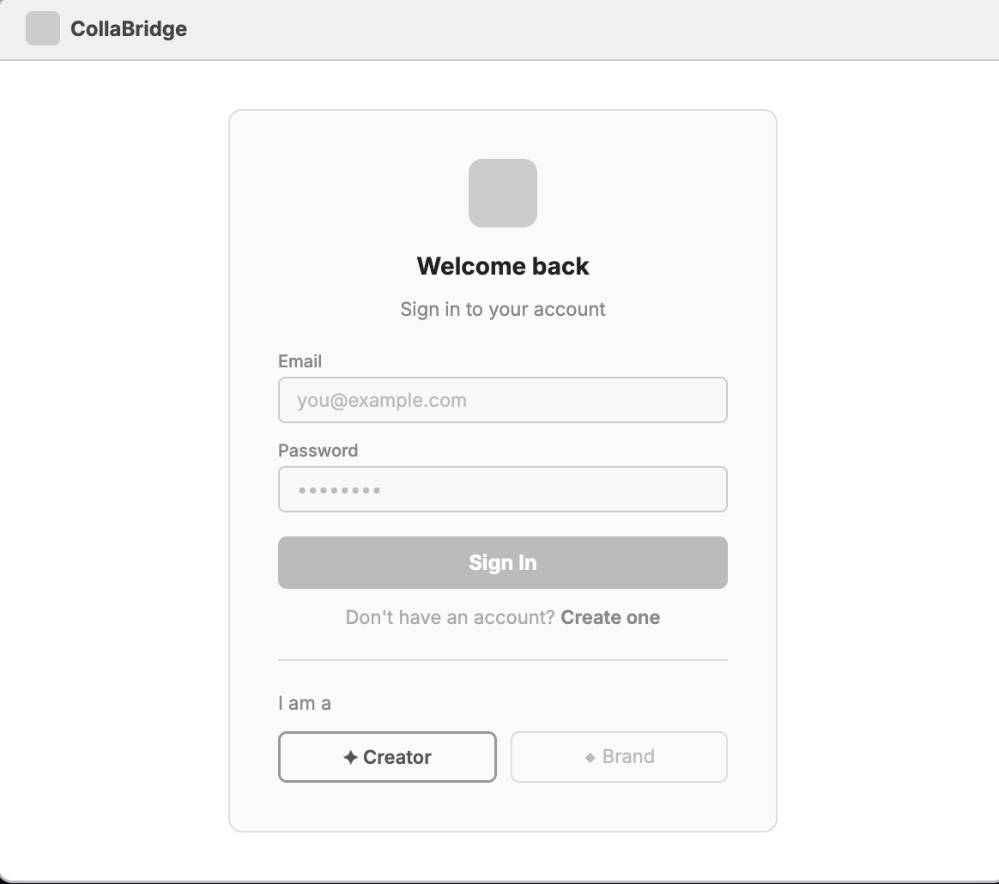
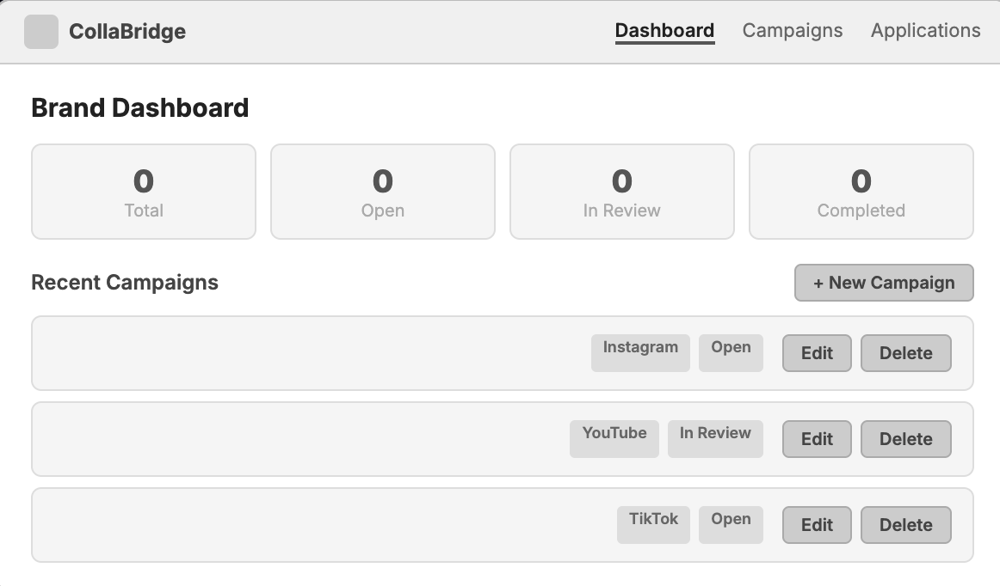
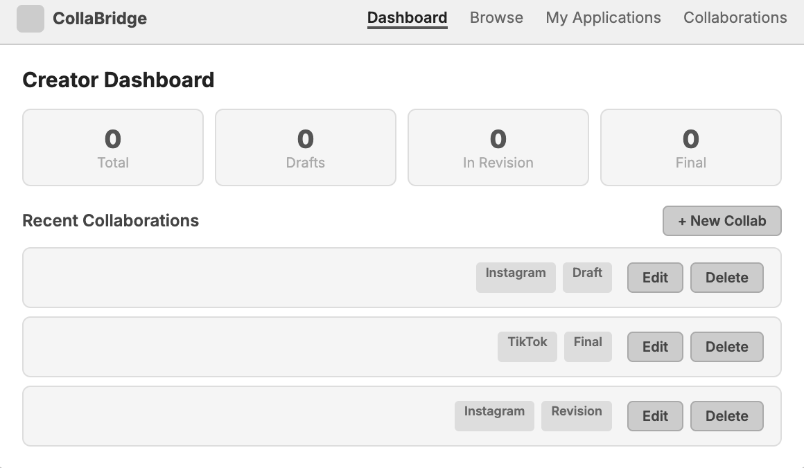
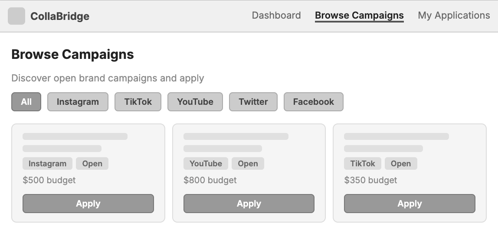

# 🤝 CollaBridge – Design Document

**Author:** Navanika Reddy, Abdullah Basarvi
**Course:** Web Development – Northeastern University
**Project Type:** Full-Stack Web Application
**Tech Stack:** Node.js, Express, MongoDB (Native Node Driver), React.js (with Hooks), CSS3

---

## 1️⃣ Project Description

CollaBridge is a full-stack web application designed to help content creators and brands manage collaborations without the chaos of scattered DMs, emails, and spreadsheets.

The application allows users to:

- Post and manage brand campaigns with budgets, deadlines, and requirements
- Maintain a personal creator collaboration workspace
- Track submission progress from Draft → Revision Requested → Final
- Browse open brand campaigns and apply directly
- Manage the full lifecycle of a creator–brand partnership in one place

The main goal of CollaBridge is to centralize creator–brand collaboration and replace fragmented communication tools with a structured, role-aware platform.

The application uses:

- Node.js + Express for backend routing
- MongoDB Atlas for database storage
- React.js with Hooks for client-side rendering
- Passport.js + JWT for role-based authentication
- Two MongoDB collections:
  - `BrandCampaigns`
  - `CreatorCollaborations`

No ORMs (Mongoose) or prohibited libraries (axios, cors) were used.

---

## 2️⃣ User Personas

### 👩 Persona 1: Student Creator – "Aisha"

**Background:**
Aisha is a college student just starting out with brand collaborations on Instagram and YouTube.

**Goals:**
- Organize brand deals in one place
- Track drafts, revisions, and final submissions
- Stay professional without expensive tools

**Pain Points:**
- Loses track of revision feedback buried in DMs
- Misses deadlines because deals are scattered across platforms
- No system to know which submissions are final vs. still in progress

**How CollaBridge Helps:**
- Gives her a personal workspace to log every collaboration
- Lets her attach submission links and add notes per deal
- Status tracking (Draft → Revision → Final) keeps her organized

---

### 👨 Persona 2: Startup Founder – "Daniel"

**Background:**
Daniel runs a DTC fashion brand and manages influencer campaigns manually through spreadsheets and Instagram DMs.

**Goals:**
- Post campaigns and manage creator applications in one place
- Track campaign status without juggling multiple tools
- Document internal goals and notes per campaign

**Pain Points:**
- Campaign details get lost across email threads
- No visibility into which campaigns are active vs. completed
- Hard to filter creators by platform or content type

**How CollaBridge Helps:**
- Lets him post campaigns with budget, deadline, and requirements
- Dashboard shows Open, In Review, and Completed campaigns at a glance
- Internal notes field keeps goals documented per campaign

---

### 👗 Persona 3: Fashion Creator – "Maya"

**Background:**
Maya handles 5–10 brand deals simultaneously across Instagram and TikTok.

**Goals:**
- Track submission progress across multiple deals
- Never miss a revision request
- Keep all brand feedback in one place

**Pain Points:**
- Revision requests get buried in email threads
- Hard to know which deals need attention right now
- No overview of how many deals are active vs. completed

**How CollaBridge Helps:**
- Personal dashboard shows all collaborations with status badges
- Revision Requested status highlights deals that need action
- Notes field stores brand feedback per collaboration

---

### 📊 Persona 4: Marketing Intern – "Kevin"

**Background:**
Kevin manages creator outreach for a mid-size e-commerce company without access to enterprise marketing tools.

**Goals:**
- Create and manage campaigns in a simple workflow
- Track which campaigns are getting applications
- Update campaign details without technical overhead

**Pain Points:**
- No dedicated tool for managing creator campaigns
- Campaign details updated manually in shared spreadsheets
- Difficult to filter campaigns by platform or status

**How CollaBridge Helps:**
- Simple campaign creation form with all required fields
- Dashboard with filters by status and platform
- Edit and delete campaigns without any technical setup

---

## 3️⃣ User Stories

### 📢 Brand Campaign Management *(Navanika Reddy)*

**User: Daniel – Startup Founder**
As a startup founder, I want to post and manage creator campaigns without juggling spreadsheets and DMs so that I can focus on growing my brand. CollaBridge allows me to create campaign listings with budgets, deadlines, and requirements, track their status from Open to Completed, and add internal notes — all from one clean dashboard.

**User: Kevin – Marketing Intern**
As a marketing intern, I want a simple workflow for creating and managing creator campaigns for my company so that I can stay organized without expensive tools. The platform lets me post campaigns, filter by platform and status, and update campaign details without any technical overhead.

**Individual Stories:**
- As a brand, I want to create a campaign posting so I can manage collaboration opportunities in the system
- As a brand, I want to view all campaigns in a dashboard so I can track active and inactive campaigns
- As a brand, I want to update campaign details like deadline, budget, and requirements so my postings stay accurate
- As a brand, I want to delete a campaign that is no longer active so the dashboard stays clean
- As a brand, I want to categorize campaigns by platform or content type so I can organize opportunities better
- As a brand, I want to mark campaigns as Open, In Review, or Completed so I can track progress
- As a brand, I want to add internal notes to a campaign so I can document goals or expectations
- As a brand, I want to filter campaigns by status or platform so I can quickly find what I need

---

### 🎨 Creator Submission Workspace *(Abdullah Basarvi)*

**User: Maya – Fashion Creator**
As a fashion creator handling multiple deals at once, I want a personal dashboard for tracking submission progress so that nothing slips through the cracks. CollaBridge lets me log each collaboration, attach draft links, mark status as Draft, Revision Requested, or Final, and add notes about brand feedback — all in one place.

**User: Aisha – Student Creator**
As a student creator, I want to create and manage my own collaboration workspace so that I can organize brand deals I am working on. The platform gives me a structured place to track due dates, submission links, and revision notes — replacing the messy mix of DMs and notes apps I used before.

**Individual Stories:**
- As a creator, I want to create and manage my own collaboration workspace so I can organize brand deals I am working on
- As a creator, I want to add a new collaboration entry with brand name, campaign title, due date, and platform so I can track my work
- As a creator, I want to view all my collaborations in one dashboard so I can manage multiple deals at once
- As a creator, I want to update collaboration details so my workspace reflects the latest information
- As a creator, I want to delete a cancelled collaboration so my dashboard stays relevant
- As a creator, I want to upload or attach a draft submission link so I can keep track of the content I prepared
- As a creator, I want to mark a submission as Draft, Revision Requested, or Final so I can track progress clearly
- As a creator, I want to add personal notes for each collaboration so I can remember feedback or posting requirements

---

## 4️⃣ Application Structure

### 📂 Backend (`backend/`)
```
backend/
├── config/         # MongoDB connection module
├── controllers/    # Route handler logic
├── middleware/     # Passport + JWT auth middleware
├── models/         # Data access layer
├── routes/         # Express route definitions
├── index.js        # Server entry point
└── seed.js         # Database seeder (1,000+ records)
```

### 📂 Frontend (`frontend/`)
```
frontend/
├── public/
└── src/
    ├── components/   # Reusable React components (one per file)
    ├── pages/        # Page-level components
    ├── styles/       # CSS (one file per component)
    ├── api/          # Fetch utility functions
    ├── context/      # Auth context
    ├── App.jsx
    └── main.jsx
```

The application follows modular organization — each React component has its own `.jsx` file and a matching `.css` file.

---

## 5️⃣ Design Mockups

### 🔐 Login & Signup


### 📢 Brand Dashboard


### 🎨 Creator Dashboard


### 🔍 Browse Campaigns


---

## 6️⃣ Technical Architecture

- Backend uses ES Modules (`type: "module"`)
- MongoDB Native Node Driver (no Mongoose)
- REST API endpoints:
  - `/api/auth` – login, register
  - `/api/campaigns` – brand campaign CRUD
  - `/api/collaborations` – creator collaboration CRUD
- Client-side rendering using React with `fetch`
- Role-based routing — Brand and Creator see different dashboards
- Passport.js + JWT for authentication
- bcrypt for password hashing
- ESLint configuration included
- Prettier formatting enforced
- MIT License included
- Environment variables stored securely in `.env`
- No secret credentials committed to GitHub

---

## 7️⃣ Usability & Accessibility

- Semantic HTML elements used throughout (`nav`, `main`, `form`, `button`)
- Proper form components — no misuse of `div` or `span` as buttons
- Clear navigation between Brand and Creator dashboards
- Role-aware UI — users only see what's relevant to their role
- PropTypes defined for every React component
- Clean, minimal interface suitable for both technical and non-technical users