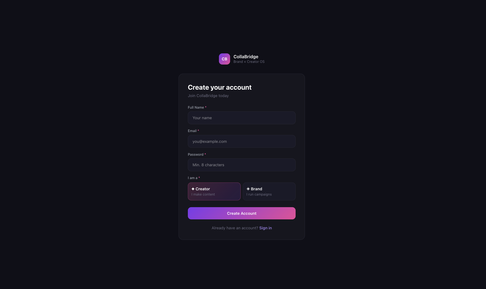
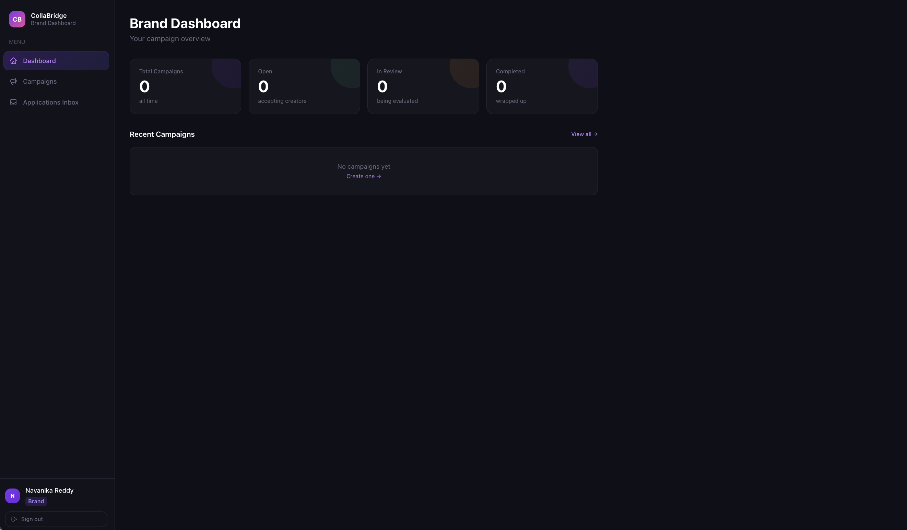
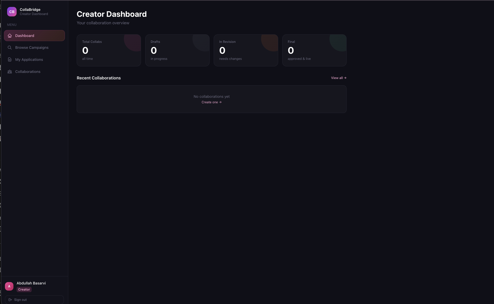
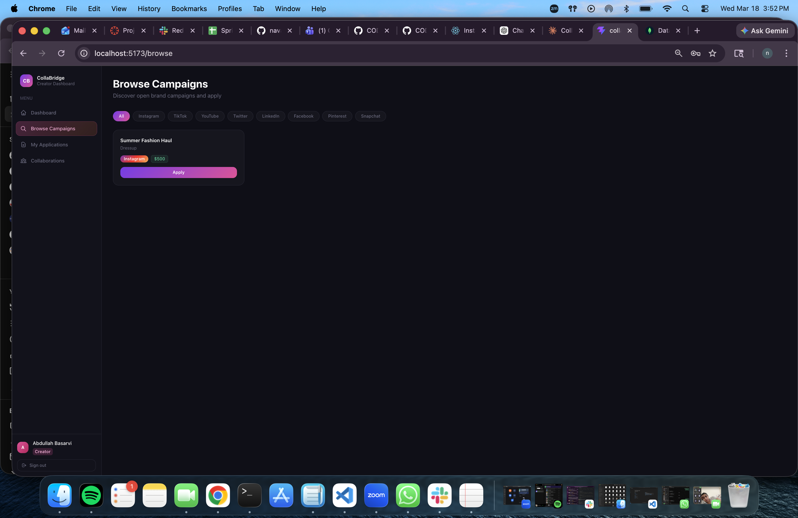

# CollaBridge

A centralized platform for managing creator-brand collaborations. Brands post campaigns with budgets and deadlines. Creators manage their submission workspace and track progress from Draft → Revision → Final. Think of it as a shared OS for influencer marketing — without the spreadsheet chaos.

## Authors

- **Navanika Reddy** (Brand Campaign Management story)
- **Abdullah Basarvi** (Creator Submission Workspace story)

## Class

CS5610 Web Development, Northeastern University, Khoury College of Computer Sciences

Class Link: https://johnguerra.co/classes/webDevelopment_online_spring_2026/

## Project Objective

CollaBridge lets brands and creators manage collaborations in one structured platform. Brands create campaign listings with platform, budget, deadline, and requirements — then track them from Open to Completed. Creators maintain a personal workspace where they log brand deals, attach submission links, mark status, and add revision notes. Creators can also browse open brand campaigns and apply directly. Each side gets a role-specific dashboard powered by Passport.js authentication.

## Live Demo

Deployed at: https://fascinating-bubblegum-34c967.netlify.app/
collabridge-frontend
 

- 🎥 **Demo Video:** https://youtu.be/your-video-link
- 📊 **Slides:** https://docs.google.com/presentation/d/1n7OU8_K_ebRPRseiF6YvSlgdLviCESxPWuSxftvvdOo/edit?usp=sharing
- 🖥️ **Frontend Repo:** https://github.com/CODE-BLANK01/CollaBridge-Frontend
- ⚙️ **Backend Repo:** https://github.com/CODE-BLANK01/CollaBridge-Backend

## Features

### Brand Campaign Management (Navanika Reddy)

- Create campaigns with title, platform, budget, deadline, and requirements
- Edit and delete campaigns
- Mark campaigns as Open, In Review, or Completed
- Add internal notes to campaigns
- Filter campaigns by status or platform
- View all campaigns in a dedicated dashboard

### Creator Submission Workspace (Abdullah Basarvi)

- Create and manage a personal collaboration workspace
- Add entries with brand name, campaign title, platform, and due date
- Attach submission links and add personal notes
- Mark submissions as Draft, Revision Requested, or Final
- Browse open brand campaigns and apply
- View all collaborations in a dedicated dashboard

## Tech Stack

- **Frontend:** React 18, React Router, Vite, PropTypes
- **Backend:** Node.js, Express.js
- **Database:** MongoDB Atlas (Native Node Driver, no Mongoose)
- **Auth:** Passport.js with JWT and bcrypt password hashing
- **Styling:** CSS3 (one CSS file per component)
- **Linting:** ESLint + Prettier

## Instructions to Build

### Prerequisites

- Node.js v18+
- MongoDB Atlas account (free tier works)

### 1. Clone the repositories

```bash
git clone https://github.com/CODE-BLANK01/CollaBridge-Backend.git
git clone https://github.com/CODE-BLANK01/CollaBridge-Frontend.git
```

### 2. Backend setup

```bash
cd CollaBridge-Backend
npm install
```

Create a `.env` file (use `.env.example` as reference):

```
PORT=3000
MONGODB_URI=your_mongodb_connection_string
ALLOWED_ORIGINS=http://localhost:5173
JWT_SECRET=your_secret_key_here
JWT_EXPIRES_IN=7d
```

Seed the database with 1,000+ synthetic records:

```bash
npm run seed
```

Start the backend:

```bash
npm run dev
```

> Backend runs at **http://localhost:3000**

### 3. Frontend setup

```bash
cd CollaBridge-Frontend
npm install
```

Create a `.env` file:

```
VITE_API_URL=http://localhost:3000
```

Start the frontend:

```bash
npm run dev
```

> Frontend runs at **http://localhost:5173**

### 4. Open the app

Visit **http://localhost:5173** and register as a **Brand** or **Creator** to explore both modules.

### 5. Linting

```bash
# Frontend
cd CollaBridge-Frontend
npm run lint

# Backend
cd CollaBridge-Backend
npm run lint
```

## Database

CollaBridge uses 2 MongoDB collections with full CRUD operations:

| Collection | Create | Read | Update | Delete | Records |
|---|---|---|---|---|---|
| BrandCampaigns | Create campaign | Dashboard, Browse | Edit campaign | Delete campaign | 500+ |
| CreatorCollaborations | Add collab | Dashboard, Workspace | Edit collab | Delete collab | 500+ |

Total synthetic records seeded: **1,000+**

## Project Structure

```
CollaBridge-Frontend/
├── public/
└── src/
    ├── components/     # React components (one per file)
    ├── pages/          # Page-level components
    ├── styles/         # CSS (one file per component)
    ├── App.jsx
    └── main.jsx

CollaBridge-Backend/
├── config/             # MongoDB connection
├── controllers/        # Route handler logic
├── middleware/         # Passport + JWT auth
├── models/             # Data access layer
├── routes/             # Express route definitions
├── index.js            # Server entry point
└── seed.js             # Database seeder
```

## Screenshots


## Login


### Brand Dashboard


### Creator Dashboard


### Browse Campaigns


## License

MIT License. See [LICENSE](./LICENSE) for details.